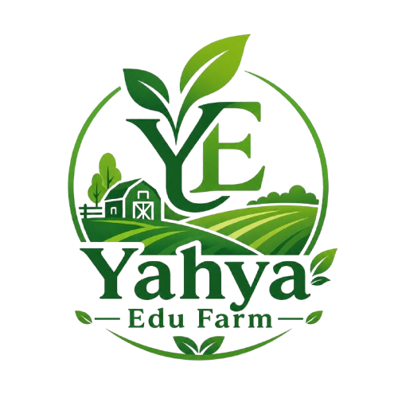

# 🌱 Yahya Edu Farm — Website Resmi

> **Belajar dari Bumi, Tumbuh Bersama Alam.**  
> Website profil dan informasi Yahya Edu Farm — ruang edukasi pertanian dan peternakan terpadu di Pontianak, Kalimantan Barat.

---

## 🖥️ Preview



**Live:** `127.0.0.1:5500/index.html` *(lokal)* — akan di-deploy segera.

---

## 📁 Struktur Project

```
yahya_edu_farm/
├── assets/
│   └── icons/
│       ├── logo.png
│       ├── instagram.png
│       ├── tiktok.png
│       └── whatsapp.png
├── css/
│   └── style.css
├── index.html
├── CLAUDE.md
├── PANDUAN-IKLAN.md
└── README.md
```

---

## ✨ Fitur

- **Hero Section** — headline, statistik, dan CTA utama
- **Tentang Kami** — latar belakang dan nilai Yahya Edu Farm
- **Program Edukasi** — 4 paket program (Wisata Anak, Workshop, Kunjungan Sekolah, Peternakan)
- **Galeri** — dokumentasi tanaman dan aktivitas kebun
- **Testimoni** — cerita dari orang tua, guru, dan komunitas
- **Kontak & Footer** — alamat, WhatsApp, Instagram, TikTok

---

## 🛠️ Teknologi

| Teknologi | Keterangan |
|-----------|------------|
| HTML5 | Struktur halaman |
| CSS3 | Styling & layout (Flexbox + Grid) |
| [Lucide Icons](https://lucide.dev/) | Icon set via CDN |
| [Google Fonts](https://fonts.google.com/) | Fraunces + Plus Jakarta Sans |

Tidak menggunakan framework — **murni HTML, CSS, dan JavaScript vanilla**.

---

## 🚀 Cara Menjalankan

```bash
# Clone repo
git clone https://github.com/rafi-zimraan/yahya_edu_farm.git

# Buka dengan Live Server (VS Code) atau langsung di browser
open index.html
```

> **Rekomendasi:** Gunakan ekstensi **Live Server** di VS Code untuk hot reload.

---

## 🏫 Sekolah Mitra

- **IYIS KB/TK Pontianak** — [@iyis_kbtk.id](https://www.instagram.com/iyis_kbtk.id/)
- **IYIS SD Pontianak** — [@iyis.sd.id](https://www.instagram.com/iyis.sd.id/)
- SD Negeri 12 Pontianak
- Komunitas Bumi Khatulistiwa
- MAN 2 Pontianak

---

## 📞 Kontak

| Channel | Info |
|---------|------|
| 📍 Lokasi | Komplek Green City Qur'an, Jl. Parit Nomor Dua, Desa Parit Baru, Pontianak |
| 📱 WhatsApp | [+62 852-4973-1265](https://wa.me/6285249731265) |
| 📧 Email | yahyaedufarm@gmail.com |
| 📸 Instagram | [@yahyaedufarm](https://www.instagram.com/yahyaedufarm/) |
| 🕐 Jam Buka | Senin–Sabtu, 08.00 – 16.30 WIB |

---

## 📄 Lisensi

© 2026 Yahya Edu Farm. Semua hak dilindungi.  
Website ini dibuat untuk keperluan promosi dan informasi Yahya Edu Farm, Pontianak.
